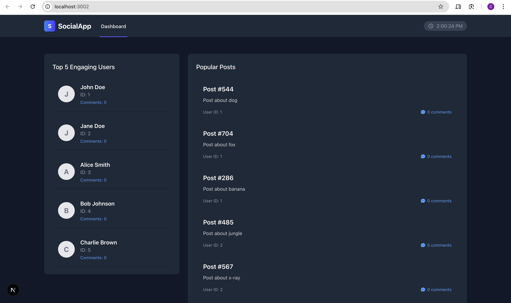
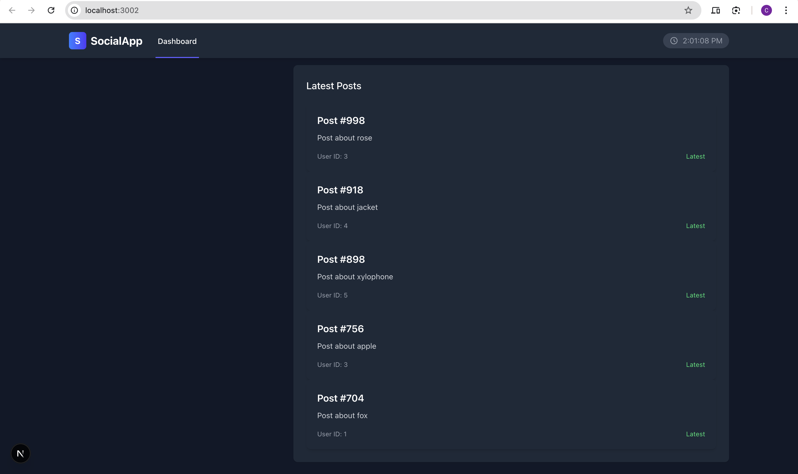
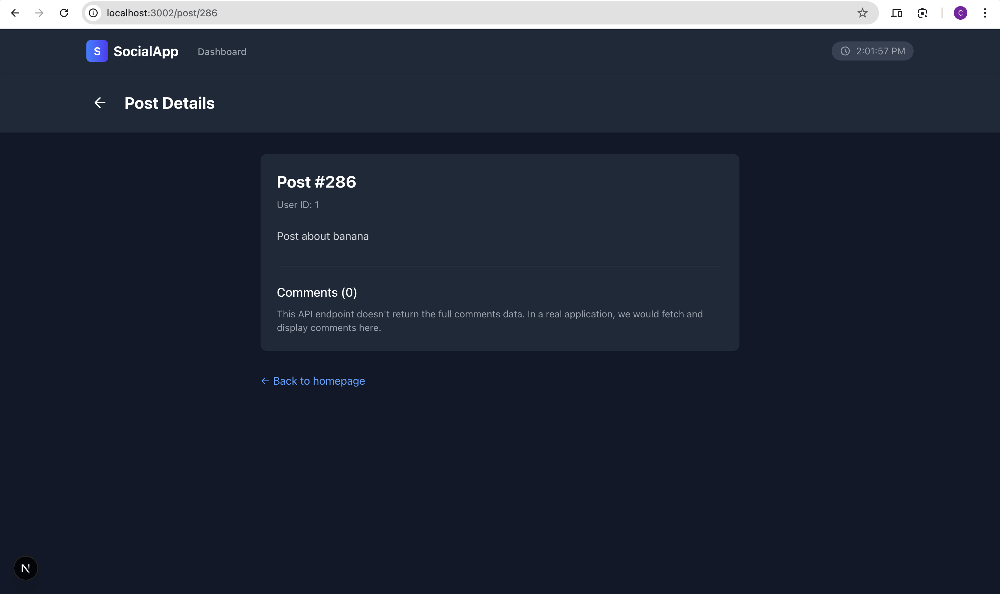

# Social Media Aggregator Frontend

A modern Next.js application for real-time social media content aggregation.

## Tech Stack

- **Framework**: Next.js 15.3.1 with App Router
- **Language**: TypeScript
- **Styling**: Tailwind CSS
- **State Management**: TanStack Query (React Query)
- **HTTP Client**: Axios
- **Font**: Geist (Sans & Mono)

## Project Architecture

### Core Structure
```
├── app/                    # Next.js App Router directory
│   ├── components/         # Shared React components
│   ├── post/              # Post-related pages
│   │   ├── [id]/          # Dynamic post route
│   │   └── layout.tsx     # Post pages layout
│   ├── services/          # API services
│   ├── types/             # TypeScript definitions
│   ├── globals.css        # Global styles
│   ├── layout.tsx         # Root layout
│   ├── page.tsx           # Home page
│   └── providers.tsx      # React Query provider
├── public/                # Static assets
```

### Key Features

- **App Router**: Leverages Next.js 15.3.1's App Router for routing
- **API Integration**: Centralized API services with Axios
- **Real-time Updates**: TanStack Query for data fetching and caching
- **Type Safety**: Full TypeScript implementation
- **Responsive Design**: Tailwind CSS with dark mode support
- **Component Architecture**: Reusable components with loading states

## Getting Started

1. Install dependencies:
```bash
yarn install
```

2. Set environment variables:
```bash
cp .env.example .env.local
```

Required variables:
```
NEXT_PUBLIC_API_URL=http://localhost:3001
```

3. Start development server:
```bash
yarn dev
```

## Available Scripts

- `yarn dev`: Start development server
- `yarn build`: Create production build
- `yarn start`: Run production server
- `yarn lint`: Run ESLint

## Browser Support

Supports all modern browsers (Chrome, Firefox, Safari, Edge)

## Screenshots

### Home Page


### Feed View


### Post Detail


### Dark Mode


## Contributing

See the main [README.md](../README.md) for contribution guidelines.
